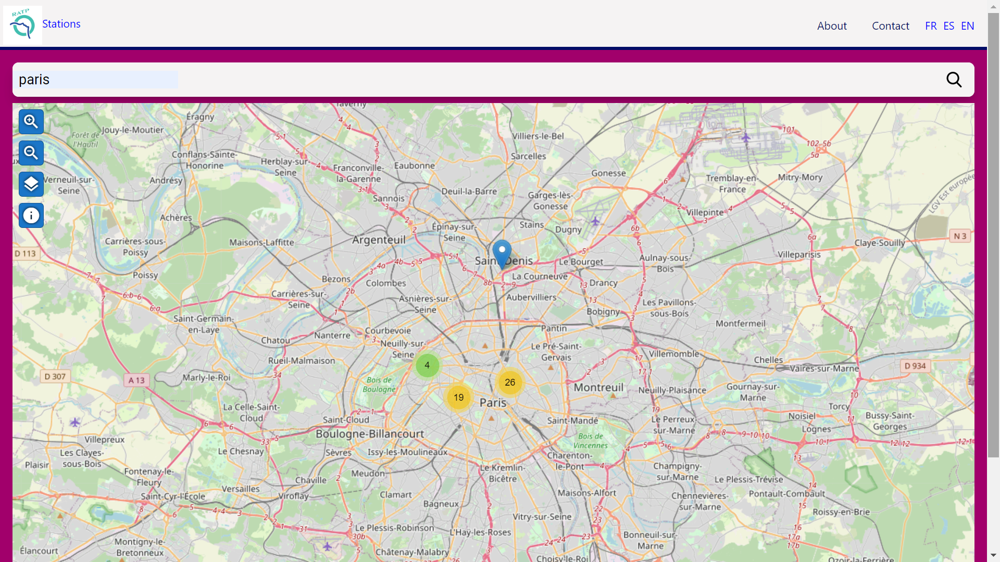

# :zap: Angular Tailwind SNCF

* Angular app using [TailwindCSS](https://developers.google.com/chart/) components to display mobility data from the [Navitia API](http://doc.navitia.io/#getting-started) with i18n language selection
* **Note:** to open web links in a new window use: _ctrl+click on link_


## :page_facing_up: Table of contents

* [:zap: Angular Tailwind SNCF](#zap-angular-tailwind-sncf)
  * [:page\_facing\_up: Table of contents](#page_facing_up-table-of-contents)
  * [:books: General info](#books-general-info)
  * [:camera: Screenshots](#camera-screenshots)
  * [:signal\_strength: Technologies](#signal_strength-technologies)
  * [:floppy\_disk: Setup](#floppy_disk-setup)
  * [:wrench: Testing](#wrench-testing)
  * [:computer: Code Examples](#computer-code-examples)
  * [:cool: Features](#cool-features)
  * [:clipboard: Status \& To-Do List](#clipboard-status--to-do-list)
  * [:clap: Inspiration](#clap-inspiration)
  * [:file\_folder: License](#file_folder-license)
  * [:envelope: Contact](#envelope-contact)

## :books: General info

* User searches for a station name and Leaflet maps shows location of stations with that name around Paris
* [Transloco](https://ngneat.github.io/transloco/) internationalization (i18n) library for Angular used to enable user to switch between English, Spanish and French. VERSION 4 ONLY - not v5 or v6 or nothing works :-(
* About and Contact pages give more information on app using Tailwind CSS cards
* To build for production Tailwind’s purge option is used to tree-shake unused styles and optimize final build size.
* [rxjs take(1) operater](https://advancedweb.hu/rxjs-the-differences-between-first-take-1-and-single/) used to take first element from the SNCF & Github observable streams then close them, so unsubscribing is not necessary.
* The Github API does not require an API key for a basic user profile search.
* The Navitia API does require an API key. It is a Hypermedia As The Engine Of Application State (HATEOAS) API that returns JSON formatted results. Using [places search](https://doc.navitia.io/#places)
* Angular standalone components used to reduce amount of code and complexity.

## :camera: Screenshots



## :signal_strength: Technologies

* [Angular framework v17](https://angular.io/)
* [Angular async pipes](https://angular.io/api/common/AsyncPipe) used with asynchronous Observable objects
* [Reactive Extensions Library for Javascript rxjs v7](https://rxjs.dev/)
* [Leaflet v1](https://leafletjs.com/) open-source JavaScript library for mobile-friendly interactive maps
* [@ngneat/transloco v4](https://ngneat.github.io/transloco/) internationalization (i18n) library for Angular. VERSION 4 ONLY. DO NOT UPDATE.
* [Tailwindcss v3](https://tailwindcss.com/) CSS framework
* [http-server](https://www.npmjs.com/package/http-server) command-line http server to view the PWA
* [Netlify CLI](https://www.npmjs.com/package/netlify-cli) to deploy app on Netlify

## :floppy_disk: Setup

* Run `npm i` to install dependencies.
* Get yourself an [API key by registering with Navitia.io](https://navitia.io/inscription/)
* Add API key to the `environments.ts` file
* Run `ng serve` for a dev server. Navigate to `http://localhost:4200/`. The app will automatically reload if you change any of the source files.
* Run `npm run build` for a production build with css purging.
* Run `http-server` to view build on an apple/android phone or simulator (pick 2nd http address supplied)
* The build artifacts will be stored in the `dist/angular-tailwind-sncf` directory.

## :wrench: Testing

* Run `ng test` to run Jasmine unit tests via [Karma](https://karma-runner.github.io). Currrently 8/12 tests pass

## :computer: Code Examples

* function from `station-list.module.ts` to return a list of stations from a user input string

```typescript
  // search for stations matching user search input
  // observable displayed in template using Angular async pipe
  onSubmitStationSearch(stationSearch: NgForm): void {
    if (this.stations) {
      this.stations = [];
    }
    let searchName = stationSearch.form.value.stationName
    if (searchName) {
      this.stationService
        .apiStationSearch(
          searchName,
          this.stationCount,
        )
        .pipe(take(this.stationCount), toArray())
        .subscribe(data => (this.stations = data[0].places));
    }
  }
```

## :cool: Features

* Lazy-loading of About and Contact pages
* Tailwind build for production CSS purge results in a very small styles bundle (about tba kB)

## :clipboard: Status & To-Do List

* Status: In work
* To-Do: Add language dropdown menu active CSS. Clear map for new search. Make it an SSR. Deploy.
* Optional: Convert to graphQL

## :clap: Inspiration

* [Angular Architects: article: Extending the Angular CLI’s build process without ejecting](https://www.angulararchitects.io/aktuelles/extending-the-angular-clis-build-process/)
* [SNCF API Dev](https://www.digital.sncf.com/startup/api/token-developpeur)
* [Navitia API Getting Started](http://doc.navitia.io/#getting-started)
* [dev.to: Setup TailwindCSS in Angular the easy way](https://dev.to/angular/setup-tailwindcss-in-angular-the-easy-way-1i5l)
* [LogRocket: Types vs. interfaces in TypeScript](https://blog.logrocket.com/types-vs-interfaces-in-typescript/)
* [Free svg site](https://freesvg.org/)
* [worldvectorlogo.com](https://worldvectorlogo.com/) svgs to download
* [Font Awesome icons](https://fontawesome.com/v6.0/icons)
* [Stackoverflow: How to add rel=“preconnect” to tags other than link?](https://stackoverflow.com/questions/54900054/how-to-add-rel-preconnect-to-tags-other-than-link)

## :file_folder: License

* This project is licensed under the terms of the MIT license.

## :envelope: Contact

* Repo created by [ABateman](https://github.com/AndrewJBateman), email: `gomezbateman@yahoo.com`
